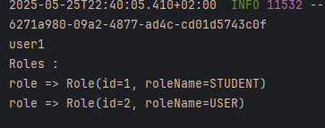

# OUMOULAY Rashid
# TP USER
# Sys Dis

<h2>Content : </h2>
<h5>Class User :</h5>

<h5>Class Role :</h5>

<h5>UserRepository :</h5>

<h5>RoleRepository :</h5>

<h5>UserService :</h5>

<h5>Add User :</h5>

<h5>Add Role :</h5>

<h5>Authentification :</h5>

<h2>Résultat :</h5>

